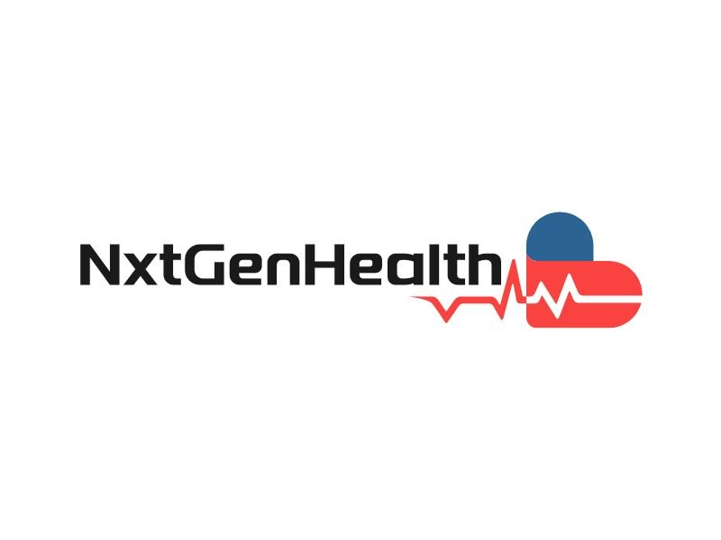

<p align="center">
  
</p>
<p align="center">
    <h1 align="center">NXTGENHEALTH - Multi-Parameter Health Risk Prediction System</h1>
</p>
<p align="center">
    <em><code>-By Team NxtGenHealth</code></em>
</p>
<p align="center">
	
	
	
	
</p>
<p align="center">
		<em>Built with the tools and technologies:</em>
</p>
<p align="center">
	
	
	
	
	
	
	
	
</p>

<br>

##### 🔗 Table of Contents

- [📍 Overview](#-overview)
- [👾 Features](#-features)
- [🎯 Objective](#-objective)
- [📂 Repository Structure](#-repository-structure)
- [🚀 Getting Started](#-getting-started)
    - [🔖 Prerequisites](#-prerequisites)
    - [📦 Installation](#-installation)
    - [🤖 Usage](#-usage)
- [🤝 Contributing](#-contributing)
- [🙌 Acknowledgments](#-acknowledgments)

---

## 📍 Overview

<code>Nowadays Many of the companies check a person's health risks based on one parameter but here we will take various parameters like Bp, Height, Weight, etc and then we will use Machine Learning Algorithm to Predict the person' health as No risk, Low risk, and High risk and based on the type of risk we will provide recommendations like Health tips, Specialist recommendations, etc and at last we will provide a report in the form of pdf which is downloadable.</code>

---
## 🎯 Objective
<code>Develop a comprehensive health risk prediction system that evaluates an individual’s health based on multiple parameters such as blood pressure (BP), height, weight, and other relevant metrics. The system will use machine learning algorithms to classify health risks into three categories: No Risk, Low Risk, and High Risk. Based on the risk category, personalized recommendations will be provided, including health tips and specialist consultations. Finally, a detailed report will be generated in PDF format for download.</code>


## 👾 Features

<code>> Predictive Health Alerts</code>
<code>> Human Computer Interraction(HCI)</code>
<code>> Genetic Engineering and Biotechnology</code>
<code>> Recommendations and Report generation</code>


---

## 📂 Repository Structure

```sh
└── NxtGenHealth/
    ├── Model.ipynb
    ├── NxtGenHealth
    ├── NxtGenHealth.csv
    ├── Preprocessing.ipynb
    ├── README.md
    ├── Result.pdf
    ├── app.py
    ├── db.sqlite3
    ├── ex1.csv
    ├── report.py
    ├── requirements.txt
    ├── static
    │   ├── Low Risk.css
    │   ├── No risk.css
    │   ├── NxtGenHealth.css
    │   ├── high risk.css
    │   └── img.jpg
    └── templates
        ├── Low Risk.html
        ├── No risk.html
        ├── NxtGenHealth.html
        ├── download.html
        └── high risk.html
```


## 🚀 Getting Started

### 🔖 Prerequisites

**Web Technologies**
**Python - 3.12(New Version)**

### 📦 Installation

Build the project from the source:

1. Clone the NxtGenHealth repository:
```sh
❯ git clone https://github.com/Badhrinadhgvs/NxtGenHealth
```

2. Navigate to the project directory:
```sh
❯ cd NxtGenHealth
```

**NOTE:** You can create any environment.

3. Install the required dependencies:
```sh
❯ ❯ pip install -r requirements.txt
```

### 🤖 Usage

To run the project, execute the following command:

```sh
❯ ❯ python app.py
```


## Project Contributors Team
- Venkata Sai Badhrinadh (Team Lead) - Backend Dev. 
- Ramya Sree Mamidi - Frontend Dev.
- sd. Shaistha Sulthana - Content Research Lead
- Jahnavi Challa - Content Researcher
- Mahendra Kannela - Content Reviewer


## 🤝 Contributing

Contributions are welcome! Here are several ways you can contribute:

- **[Report Issues](https://github.com/Badhrinadhgvs/NxtGenHealth/issues)**: Submit bugs found or log feature requests for the `NxtGenHealth` project.
- **[Submit Pull Requests](https://github.com/Badhrinadhgvs/NxtGenHealth/blob/main/CONTRIBUTING.md)**: Review open PRs, and submit your own PRs.
- **[Join the Discussions](https://github.com/Badhrinadhgvs/NxtGenHealth/discussions)**: Share your insights, provide feedback, or ask questions.

<details closed>
<summary>Contributing Guidelines</summary>

1. **Fork the Repository**: Start by forking the project repository to your github account.
2. **Clone Locally**: Clone the forked repository to your local machine using a git client.
   ```sh
   git clone https://github.com/Badhrinadhgvs/NxtGenHealth
   ```
3. **Create a New Branch**: Always work on a new branch, giving it a descriptive name.
   ```sh
   git checkout -b new-feature-x
   ```
4. **Make Your Changes**: Develop and test your changes locally.
5. **Commit Your Changes**: Commit with a clear message describing your updates.
   ```sh
   git commit -m 'Implemented new feature x.'
   ```
6. **Push to github**: Push the changes to your forked repository.
   ```sh
   git push origin new-feature-x
   ```
7. **Submit a Pull Request**: Create a PR against the original project repository. Clearly describe the changes and their motivations.
8. **Review**: Once your PR is reviewed and approved, it will be merged into the main branch. Congratulations on your contribution!
</details>


## 🙌 Acknowledgments

- We would like to express our sincere gratitude to everyone who contributed to the development of this Multi-Parameter Health Risk Prediction System especially my team mates.
---
